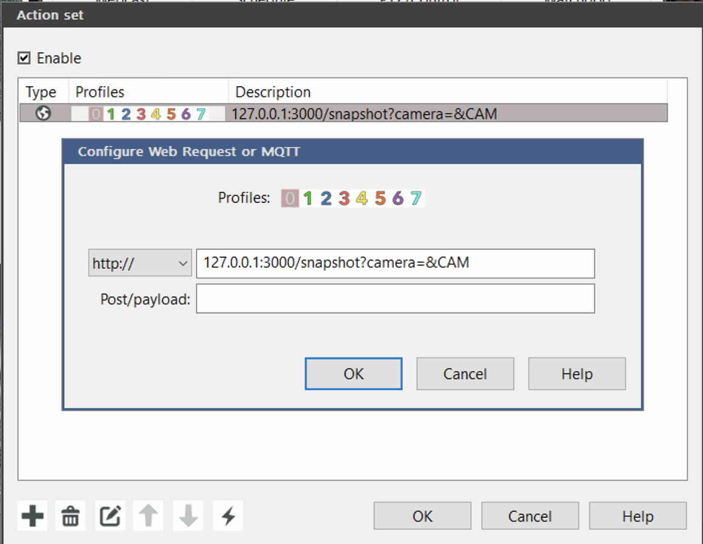

# Telegram bot for Blue Iris
Telegram bot that sends an image or a short gif on alerts triggered in Blue Iris

# Requirements
NodeJS

# Installation
1. Either use git clone (if you have git installed) or download this repo as zip and unpack it
2. Use NodeJS command line tool and navigate to the folder
3. Use npm install inside project folder to install all the dependencies
4. Fill out the conf.json file with your settings
5. Use npm start to start the telegram bot
6. Send a message containing /start to the bot in Telegram
7. Copy the chat id in the NodeJS command line into the `ALLOWED_USER` section in conf.json e.g. `"ALLOWED_USER": [11111111]`
8. In Blue Iris add an alert trigger using webhook with the following url `http://ip-of-nodejs-server:3000/snapshot?camera=$CAM`

